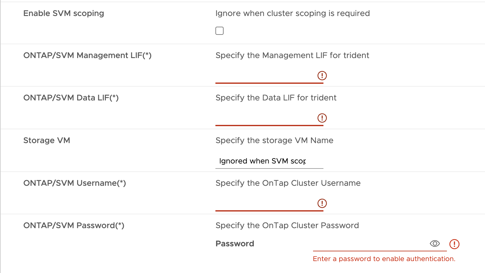

= Cómo implementar una configuración de nodo único que no sea de alta disponibilidad
:allow-uri-read: 
:icons: font
:imagesdir: ../media/

[role="lead"]
Se puede configurar un solo nodo sin alta disponibilidad en configuraciones pequeñas, medianas o grandes.

* La configuración pequeña que no es de alta disponibilidad contiene 8 CPU y 16 GB de RAM.
* La configuración media sin alta disponibilidad contiene 12 CPU y 24 GB de RAM.
* La configuración grande que no es de alta disponibilidad contiene 16 CPU y 32 GB de RAM.

Asegúrese de que la ruta de red está presente.
Ejemplo: C1_sti67-vsim-ucs154k_1679633108::> network route create -vserver <SVM> -destination 0,0.0.0/0 -gateway <gateway_ip>

*Acerca de esta tarea*

Esta tarea le da instrucciones sobre cómo instalar un nodo único no HA en configuraciones pequeñas, medianas o altas.

* Pasos*

. Inicie sesión en vSphere Server.
. Desplácese hasta el pool de recursos o el host en el que desea implementar el OVA.
. Haga clic con el botón derecho en el centro de datos requerido y seleccione *Implementar plantilla OVF...*.
. Puede introducir la URL del archivo _.ova_ o navegar hasta la carpeta donde se guarda el archivo _.ova_ y, a continuación, seleccionar *Siguiente*.
. Seleccione un nombre y una carpeta para la máquina virtual y seleccione *Siguiente*.
. Seleccione el host y seleccione *Siguiente*
. Revisa el resumen de la plantilla y selecciona *Siguiente*.
. Lea y acepte el contrato de licencia y seleccione *Siguiente*.
. En la ventana *Configuración*, seleccione la configuración *Nodo único no HA (pequeño)*, *Nodo único no HA (medio)* o *Nodo único no HA (grande)*.
. En la ventana Configuración, elija el tamaño requerido de la configuración Nodo único No HA y seleccione *Siguiente*.
. Seleccione el almacén de datos donde necesita implementar el OVA y seleccione *Siguiente*.
. Seleccione la red de origen y destino y seleccione *Siguiente*.
. Selecciona *Personalizar plantilla* > *configuración del sistema* ventana. Introduzca los siguientes detalles:
+
.. Nombre de usuario y contraseña del proveedor de VASA: Este nombre de usuario y contraseña se usan para registrar el proveedor de VASA en vCenter.
.. La casilla de verificación *Activar ASUP* está seleccionada de forma predeterminada.
+
El soporte ASUP solo puede habilitarse o deshabilitarse durante la implementación.

.. Nombre de usuario del administrador y contraseña del administrador: Esta es la contraseña utilizada para iniciar sesión en la interfaz de usuario del Administrador de herramientas de ONTAP*.
.. Introduzca la información del servidor NTP en el campo *Servidores NTP*.
.. Contraseña de usuario de mantenimiento: Se utiliza para otorgar acceso a “Opciones de consola de mantenimiento”.

. En la ventana *Personalizar plantilla* > *Certificados de proveedor VASA*, introduzca los siguientes detalles:
+
.. Active la casilla de verificación Activar certificado de CA personalizado. Esto es necesario para la habilitación de múltiples VC. En el caso de un entorno que no sea multi-VC, ignore la casilla de verificación. No es necesario mencionar los certificados y el nombre de dominio, solo debe proporcionar los detalles de IP virtual.
.. Copie y pegue los certificados raíz e intermedios.
.. Copie y pegue los certificados Leaf y la clave privada.
.. Introduzca el nombre de dominio con el que ha generado el certificado.
.. Introduzca los detalles de IP de equilibrio de carga.

. En la ventana *Personalizar plantilla* > *Configuración de implementación*, introduzca los siguientes detalles:
+
.. Introduzca una dirección IP libre en IP virtual para el plano de control K8s. Necesitas esto para K8s API Server.
.. Seleccione la casilla de verificación en la opción *Enable SVM scoping* cuando desee usar Direct SVM. Para usar el clúster de ONTAP, no seleccione la casilla de comprobación.
+

NOTE: Cuando el ámbito de SVM está habilitado, ya debe haber habilitado la compatibilidad con SVM con IP de gestión.

.. Introduzca los detalles que se muestran en la siguiente imagen:
+

.. Introduzca el clúster de ONTAP o la IP de gestión de SVM en *LIF de gestión de ONTAP/SVM*.
.. Introduzca el clúster de ONTAP o la SVM *ONTAP/SVM LIF de datos*.
.. Para la VM de almacenamiento, puede elegir proporcionar los detalles de la VM de almacenamiento predeterminada de ONTAP, o bien crear una nueva VM de almacenamiento. No introduzca el valor en el campo *Storage VM* cuando se selecciona Activar ámbito de SVM, ya que se ignora este archivo.
.. Introduzca el nombre de usuario de ONTAP/SVM.
.. Introduzca la contraseña de ONTAP/SVM.
.. La opción Activar migración está desactivada por defecto. No alteres esta opción.
.. La VM principal está habilitada de forma predeterminada. No alteres esta opción.

. En la ventana *Customize template* > *Node Configuration*, introduzca las propiedades de red del OVA.
+

NOTE: La información proporcionada aquí se validará para los patrones adecuados durante el proceso de instalación. En caso de discrepancia, se mostrará un mensaje de error en la consola web y se le pedirá que corrija cualquier información incorrecta proporcionada.

+
.. Introduzca el nombre de host.
.. Introduzca la dirección IP asignada al nombre de host.
.. Longitud de prefijo (solo para IPv6)
.. Máscara de red (solo para IPv4)
.. Puerta de enlace
.. DNS principal
.. DNS secundario
.. Buscar dominios

. Revisa los detalles en la ventana *Listo para completar*, selecciona *FINALIZAR*.
+
A medida que se crea la tarea, el progreso se muestra en la barra de tareas de vSphere.

. Encienda la máquina virtual después de completar la tarea.
+
Comienza la instalación. Puede realizar un seguimiento del progreso de la instalación en la consola web de VM.
Como parte de la instalación, se validan las configuraciones de nodos. Las entradas proporcionadas en diferentes secciones bajo la *Personalizar plantilla* en el formulario OVF son validadas. En caso de discrepancias, un cuadro de diálogo le solicita que realice una acción correctiva.

. Para realizar los cambios necesarios en el cuadro de diálogo, siga los pasos que se indican a continuación:
+
.. Haga doble clic en la consola web para comenzar a interactuar con la consola.
.. Utilice las teclas de flecha ARRIBA y ABAJO del teclado para navegar por los campos mostrados.
.. Utilice las teclas de flecha DERECHA e IZQUIERDA del teclado para navegar hacia el extremo derecho o izquierdo del valor proporcionado al campo.
.. Utilice LA PESTAÑA para navegar por el panel e ingresar sus valores, *OK* o *CANCEL*.
.. Utilice ENTER para seleccionar *OK* o *CANCEL*.

. Al seleccionar *OK* o *CANCEL*, los valores proporcionados se volverán a validar. Usted tiene la disposición para corregir cualquier valor por 3 veces. Si no se corrige en los 3 intentos, la instalación del producto se detiene y se recomienda que pruebe la instalación en una máquina virtual nueva.
. Después de la instalación correcta, la consola web muestra el mensaje que indica que las herramientas de ONTAP para VMware vSphere están en buen estado.

